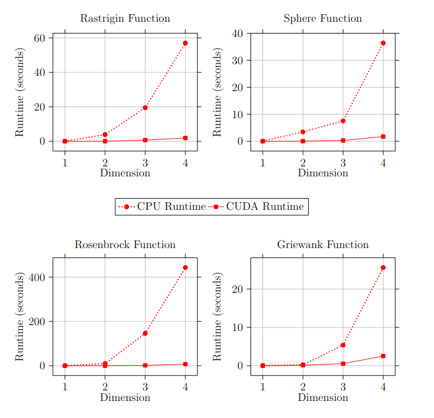

# Prism Refraction Search (PRS) - CUDA Implementation

A Novel Physics-Based Metaheuristic Algorithm

[Springer, The Journal of Supercomputing, Published: 04 January 2024](https://link.springer.com/article/10.1007/s11227-023-05790-3)

## Project Overview  

This project implements the **Prism Refraction Search (PRS) Algorithm** using **CUDA C** to leverage parallel computation for improved performance. The PRS algorithm, inspired by the principles of light refraction through a prism, is a novel metaheuristic optimization method designed for solving global optimization problems.

This project was submitted as part of the final project for **CS326 - High Performance Computing** at **NIT Surat** in 2025.

## Objectives  

- Implement the **sequential PRS algorithm** based on the original research paper.  
- Develop a **parallel CUDA implementation** to enhance computational efficiency.  
- Compare the **performance of sequential and parallel implementations** on benchmark optimization problems.  

## Features  

- Implementation of the **sequential PRS algorithm** in C.  
- Development of a **parallelized CUDA version** to accelerate computation.  
- Performance benchmarking on standard optimization problems.  
- Comparative analysis of execution time and scalability.  

## Installation and Usage

Clone the project repository and compile source files:

```bash
git clone https://github.com/xshthkr/prs-cuda.git
cd prs-cuda
make
```

Compare naive sequential and CUDA parallel execution:

```bash
make compare
```

## CPU-based Prism Refraction Search

```txt
1:  Initialize population of N solutions

2:  Initialize prism angle A₀

3:  For t = 1 to MaxIter do

4:      For each solution i in 1 to N do
5:          Calculate deviation δₜ[i] = f(iₜ[i])     // Fitness
6:          If δₜ[i] < BestScore:
7:              BestScore = δₜ[i]
8:              BestSolution = iₜ[i]
9:          End if
10:     End for

11:     Calculate refractive index μₘ:
            μₘ = sin((A₀ + δₜ) / 2 ) / sin(A₀ / 2)   // Refractive index Eq.10

12:     For each solution i in 1 to N do
13:         For each dimension j in 1 to D do
14:             Eₜ[i][j] = δₜ[i] - iₜ[i][j] + Aₜ     // Emergent angle Eq.9
15:             r₁ = random number in [-1, 1]
16:             iₜ₊₁[i][j] = asin(...)               // Incidence angle Eq.11
17:             Ensure iₜ₊₁[i][j] is within bounds
18:         End for
19:     End for

20:     Update prism angle Aₜ₊₁:
            Aₜ₊₁ = Aₜ × ((alpha - t) / MaxIter)      // Prism angle Eq.12

21: End for

22: Return BestSolution, BestScore
```

Running this on the **4-dimensional [Rastrigin function](https://en.wikipedia.org/wiki/Rastrigin_function)**, which has many local minimas, using a population size of 1000, the cpu-based prism refraction search algorithm converged on the global minima in **about 50 seconds**.

```txt
Parameters:
  Dimension: 4
  Max Iterations: 6000
  Population size: 1000
  Alpha: 0.009000
Best solution:
  0.002293
  0.003727
  -0.004454
  0.007831
Best score: 0.019900
Elapsed time: 53.258303 seconds
```

The algorithm discovered a solution with a score of `0.0199` in `53.26` seconds. The accuracy is impressively high, at the cost of a high runtime.

Lets compare this result with the CUDA-based PRS Optimizer.

## CUDA-based Prism Refraction Search

### Kernels

- `prs_init_incident_angles_kernel` - one thread per solution to initialize solution components with random numbers in (0,90)
- `prs_init_emergent_angles_kernel` - one thread per solution to initialize components with 0.
- `prs_calculate_fitness_kernel` - one thread per individual in population, fitness of every solution is added to an array.
- `prs_reduce_fitness_sum_block_kernel` - block level reduction of fitness array to find block level fitness sums
- `prs_reduce_fitness_sum_final_kernel` - global level reduction of block level sums to get a final global sum
- `prs_reduce_fitness_min_block_kernel` - block level reduction of fitness to find minimum of block level fitnesses and its index in fitness array
- `prs_reduce_fitness_min_final_kernel` - global level reduction of block level fitness minimums to get final global minimum and index
- `prs_copy_best_solution_kernel` - one thread per dimension to copy best solution
- `prs_update_emergent_prs_update_incident_kernel` - one thread per (individual, dimension) pair to calculate emergent angle components and update corresponding incident angle component

### Memory Allocation on GPU and CPU

| Data | Location | Notes |
| ---- | -------- | ----- |
| `incident_angles` (pop_size × dim) | GPU | Updated every iteration |
| `emergent_angles` (pop_size × dim) | GPU | Fully device-side |
| `solution` (dim) | GPU scratch per thread (or shared memory) | Used for converting angles to solutions |
| `best_solution` (dim) | Host + GPU | Tracked both sides; updated if a better one found |
| `best_score` | Host + GPU | Same as above |
| `lowerbound`, `upperbound` (dim) | Copied to GPU | Read-only constants for mapping angles to real values |
| `delta_t` | GPU (per iteration) | Global sum or average – use atomic or reduction |
| `prism_angle` | Host + GPU | Updated on host, copied to GPU (or done in kernel if needed) |
| `params` | CPU constant memory | Accessed frequently, rarely changes |

### Pseudocode

```txt
1:  Kernel to initialize population of N solutions

2:  Initialize prism angle A₀

3:  For t = 1 to MaxIter do

4:      Kernel to calculate delta for every solution

5:      Kernel to reduce delta to average delta_t

6:      Calculate refractive index μₘ:
            μₘ = sin((A₀ + δₜ) / 2 ) / sin(A₀ / 2)   // Refractive index Eq.10

7:      Kernel to calculate emergent angle           // Eq. 9
            and update incident angles               // Eq. 11

8:      Update prism angle Aₜ₊₁:
            Aₜ₊₁ = Aₜ × ((alpha - t) / MaxIter)      // Prism angle Eq.12

9:      Kernel to update BestSolution and BestScore

10: End for

11: Return BestSolution, BestScore
```

Running this on the same 4-dimensional Rastrigin function, we get the following results.

```txt
Number of CUDA devices: 1
Device 0: NVIDIA GeForce MX250
  Total global memory: 4230086656 bytes
  Multiprocessor count: 3
  Max threads per block: 1024
Parameters:
  Dimension: 4
  Max Iterations: 10000
  Population size: 1024
  Alpha: 0.009000
Best solution:
  0.009845
  0.001369
  0.013489
  0.000200
Best score: 0.055679
Elapsed time: 1.451018 seconds
```

The algorithm discovered a solution with a score of `0.055679` in `1.45` seconds. This is a **36.7 times speedup**.



This CUDA-accelerated algorithm gave us a faster and more accurate result compared to the CPU-based implementation. This demonstrates the significant improvements that parallelized algorithms can achieve over their sequential counterparts.

## Improvements and Considerations

The prism refraction search algorithm is mainly an `exploitation` algorithm. The only `exploratory` work done by the algorithm is when the angles are initialized with random numbers. This algorithm is most suitable to be used as a finer search algorithm to be used after narrowing down the search space with a more efficient `exploration` algorithm.

Although my CUDA implementation of this algorithm is incredibly faster, my implementation suffers with scalability issues. I am not sure whether this is becuase of the random number generator I have used within my kernels, but to have a higher `exploration` of the solution search space, the `max_iterations` needs to be really high.

There are several improvements that can be done in my implementation:

- Better memory allocation for improved memory coalesence. Kernels are faster when the threads in a warp access sequential data. Since my array of solutions is a 2D array, I have to flatten it to store in the GPU. There is a memory allocation function for 3D data but the documentations and implementations I have read seem to indicate that in my case padding would be required which would make it inefficient.

- Kernels can be designed more elegently. Nvidia's documentation and forums discuss the various techniques of reduction of the sums and minimums of arrays can be implemented with better efficiency.

## Conclusion

This CUDA-accelerated algorithm produced significantly faster and more accurate results compared to the CPU-based implementation. In our tests, the GPU version achieved a **40x** speedup while handling a larger population size and more iterations. It also found a better solution, demonstrating how parallelization not only boosts performance but can also enhance solution quality. These results underscore the benefits of leveraging GPU computing for population-based metaheuristic algorithms.

## Requirements

- Linux
- Dependencies: GNU math library (math.h)
- Nvidia GPU (cuda 6.1 or higher)

## References  

- [Kundu, R., Chattopadhyay, S., Nag, S. et al. **"Prism refraction search: a novel physics-based metaheuristic algorithm."** J Supercomput 80, 10746–10795 (2024).](https://doi.org/10.1007/s11227-023-05790-3)
- [Rastrigin, L. A. **"Systems of extremal control."** Mir, Moscow (1974).](https://en.wikipedia.org/wiki/Rastrigin_function)
- [NVIDIA CUDA Toolkit](https://developer.nvidia.com/cuda-toolkit)  
